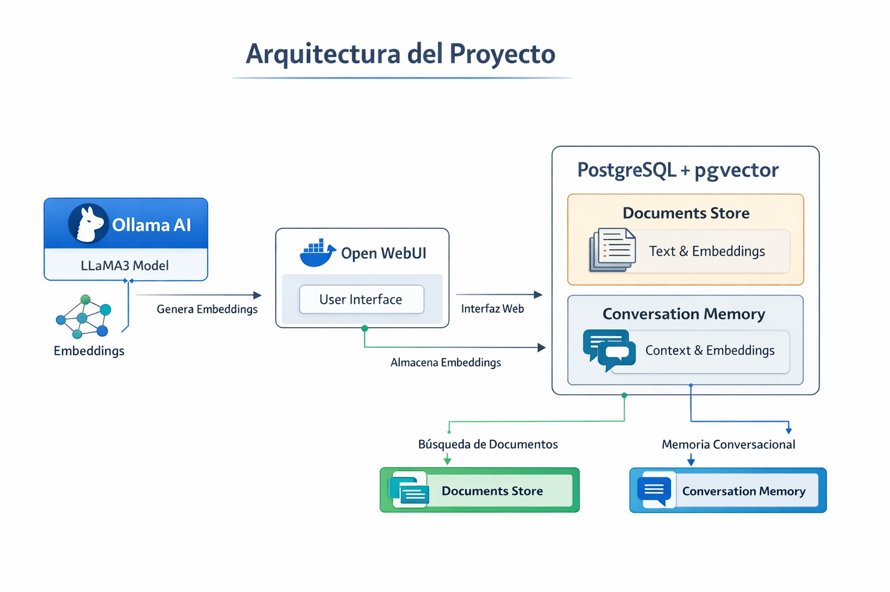

# Proyecto Ollama: Gestión de Documentos y Memoria Vectorial

Este proyecto es un **servicio de IA local** usando **Ollama** para procesamiento de lenguaje natural, con **almacenamiento vectorial en PostgreSQL** mediante **pgvector** y acceso a través de un **WebUI**.

El objetivo es almacenar documentos, generar embeddings, y mantener una memoria conversacional para aplicaciones de IA contextuales y personalizadas.

---

## Arquitectura del Proyecto



**Flujo básico de uso:**

1. El modelo Ollama genera embeddings de documentos o conversaciones.
2. Los embeddings se almacenan en PostgreSQL con pgvector.
3. La memoria conversacional permite mantener contexto entre interacciones.
4. Open WebUI ofrece una interfaz visual para administración y pruebas.

---

## Requisitos

- [Ollama](https://ollama.com)
- [Docker](https://www.docker.com/)
- PostgreSQL con [pgvector](https://github.com/pgvector/pgvector)

---

## Instalación y Configuración

### 1. Ejecutar Ollama

```bash
ollama run llama3
```

### 2. Verificar Docker

```bash
docker --version
```

### 3. Levantar Open WebUI

```bash
docker run -d ^
  -p 3000:8080 ^
  -e OLLAMA_BASE_URL=http://host.docker.internal:11434 ^
  --name open-webui ^
  --restart always ^
  ghcr.io/open-webui/open-webui:main
```

**Acceso:** `http://localhost:3000`

### 4. Instalar PostgreSQL con pgvector

```bash
docker run -d \
  -p 5432:5432 \
  -e POSTGRES_PASSWORD=postgres \
  ankane/pgvector
```

Habilitar extensión vector:

```sql
CREATE EXTENSION IF NOT EXISTS vector;
```

---

## Estructura de Base de Datos

### Tabla de Documentos

```sql
CREATE TABLE documents (
  id SERIAL PRIMARY KEY,
  content TEXT,
  embedding vector(768)
);
```

### Tabla de Memoria Conversacional

```sql
CREATE TABLE conversation_memory (
  id SERIAL PRIMARY KEY,
  content TEXT,
  embedding VECTOR(768)
);
```

---

## Consultas de Apoyo

```sql
-- Revisar dimensiones del embedding
SELECT vector_dims(embedding) FROM documents LIMIT 1;

-- Consultar documentos
SELECT * FROM documents;

-- Consultar memoria conversacional
SELECT * FROM conversation_memory;

-- Limpiar documentos
TRUNCATE documents;
```

---

## Próximos Pasos / Roadmap

1. Integrar **búsqueda semántica** usando embeddings de Ollama.
2. Crear **API REST** para agregar y consultar documentos y memoria.
3. Desarrollar un **agente conversacional** que utilice la memoria vectorial.
4. Mejorar la **interfaz WebUI** para administración de documentos y conversaciones.
5. Explorar **vector DB más avanzadas** si el proyecto crece (p.ej. Milvus o Weaviate).
